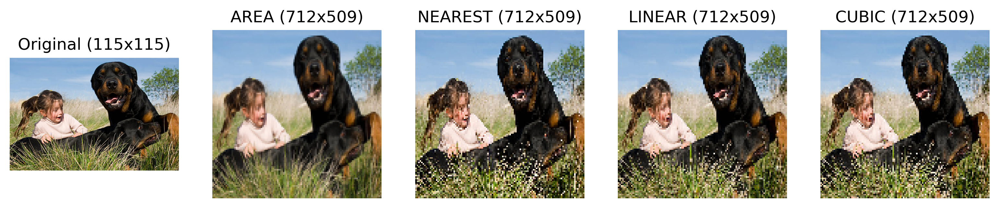

# Métodos de Interpolação Para Processamento de Imagens

**Autor:** Murilo Rocha  

## Introdução

O processamento de imagens digitais é uma área que tem experimentado um crescimento notável, impulsionado tanto pelo avanço tecnológico quanto pela crescente demanda por aplicações em diversos campos, como medicina, vigilância e entretenimento. No coração dessas aplicações, encontra-se a necessidade de transformações de imagens que muitas vezes incluem operações de redimensionamento, rotação e distorção geométrica. Tais transformações são fundamentadas em métodos de interpolação, que desempenham um papel crucial na preservação da qualidade visual da imagem.

Métodos de interpolação, como interpolação bilinear, bicúbica e vizinho mais próximo, são técnicas padrão na indústria para redimensionar imagens. Cada um desses métodos possui características únicas em termos de complexidade computacional e qualidade da imagem resultante. A escolha do método adequado depende da aplicação específica e dos requisitos de qualidade da imagem. Este trabalho visa explorar os diferentes métodos de interpolação no contexto do processamento de imagens, discutindo suas vantagens, limitações e aplicações ideais.

Além disso, será abordada a importância da interpolação na manutenção da integridade da informação visual durante o processamento da imagem. Através de experimentos e análises, este estudo busca fornecer uma compreensão aprofundada sobre como os métodos de interpolação afetam a qualidade da imagem e a eficiência computacional em diferentes cenários de processamento de imagens.

## Interpolação em Processamento de Imagens

A interpolação em processamento de imagens é uma técnica matemática usada para redimensionar imagens. Quando uma imagem é ampliada ou reduzida, novos pixels são criados ou pixels existentes são removidos. A interpolação determina os valores desses novos pixels calculando-os com base nos valores dos pixels vizinhos e na aplicação de um algoritmo específico. Existem vários métodos de interpolação, como vizinho mais próximo, bilinear, bicúbica e Lanczos, cada um com diferentes qualidades e usos recomendados dependendo do contexto específico e do resultado desejado.

## Métodos de Interpolação

A interpolação é crucial para transformações de imagem, permitindo estimar novos pixels. Métodos variam conforme a aplicação:

- **INTER_AREA (Interpolação de Área):** Recomendado para a redução de tamanho de imagens. Este método calcula o valor de um pixel pela média ponderada dos pixels na área de origem correspondente. É eficaz para evitar artefatos de Moiré que são comuns em outras técnicas durante a redução da imagem.

- **INTER_NEAREST (Interpolação por Vizinho Mais Próximo):** Método mais simples e eficiente, ideal para imagens com alta resolução quando a velocidade é crucial. Seleciona o valor do pixel mais próximo do ponto transformado, resultando em uma imagem com pixelização visível, especialmente em ampliações significativas.

- **INTER_LINEAR (Interpolação Bilinear):** Método que equilibra qualidade e rapidez, adequado para redimensionamentos moderados. Ele calcula o valor do pixel como uma média ponderada linear dos quatro pixels mais próximos. Oferece melhores resultados que o vizinho mais próximo, evitando pixelização excessiva, mas ainda pode apresentar alguma perda de detalhes em ampliações grandes.

- **INTER_CUBIC (Interpolação Bicúbica):** Oferece suavidade superior, sendo ideal para ampliações de imagem. Utiliza uma função cúbica para estimar o valor dos novos pixels com base nos 16 pixels mais próximos (4x4 área) ao redor do pixel alvo. Este método produz imagens mais suaves e com melhor preservação de detalhes em comparação com a interpolação bilinear, sendo preferível para ampliações significativas e quando a qualidade é mais importante que a velocidade de processamento.

### Interpolação Ideal para Ampliação e Redução de Imagens

**Redução de Dimensões:** Para a redução das dimensões de uma imagem, o método `cv2.INTER_AREA` do OpenCV é frequentemente recomendado. Este método calcula a média ponderada dos pixels em uma região específica, preservando as características essenciais da imagem e minimizando artefatos, tornando-o ideal para a redução do tamanho da imagem com a manutenção da qualidade.

**Aumento de Dimensões:** Ao aumentar as dimensões de uma imagem, a Interpolação Bicúbica (`cv2.INTER_CUBIC`) é geralmente a mais eficaz. Considerando os pixels circundantes de forma mais abrangente, este método é eficiente na preservação de detalhes e na suavização de bordas, resultando em imagens ampliadas com maior nitidez e menos artefatos visuais.

